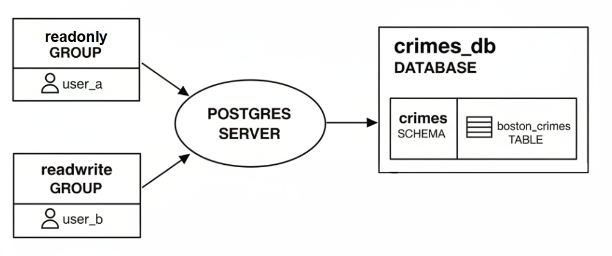

# Crimes Database

In this project, guided by DataQuest, we will explore the core principles of database administration and design using **PostgreSQL**. Our objective is to transition from raw data to a structured, secure, and optimized relational database environment.

View this project live on Google Colab [here](https://colab.research.google.com/drive/10I14mp4SyhmxhNbEjHbL0Ly0WvCbBEVq?usp=sharing)
